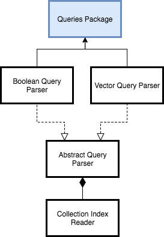
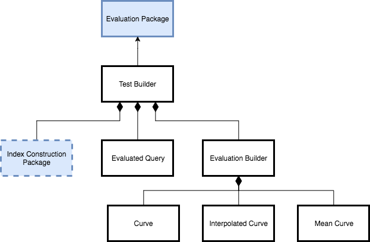

# Tiny Search Engine

Information Retrieval project for class IS3013AA

### Table of Contents
+ **[Usage Instructions](#usage-instructions)**  
+ **[Architecture](#architecture)**  
    + **[Global Architecture](#global-architecture)**
    + **[Limitations](#limitations)**
+ **[Performances](#performances)**
    + **[Index Construction](#index-construction)**
    + **[Index Size](#index-size)**
    + **[Requests Performance](#requests-performance)**
    + **[Engine Evaluation](#engine-evaluation)**
+ **[Appendix](#appendix)**

***

## Usage Instructions

**Note:** the aliases used for `python3` and `pip3` in this document may vary from one computer to another.

### Requirements

* Python (3.5)
* matplotlib (2.0.0)
* PorterStemmer (0.5)

Run the script below to download the requirements with `pip`:
```bash
pip3 install -r requirements.txt
```

### Build the collection folders

This engine supports 2 collections: `cacm` and `CS276`. In order to limit its size, collections are not included in this repo.

Collection folders must be added at the root of this repo and respect the structure below:

```bash
.
|- {collection_name}-data
|   |-- 0
|   |   |-- document_0_1
|   |   |-- document_0_2
|   |   |...
|   |-- 1
|   |   |-- document_1_1
|   |   |...
```

Each subfolder `0/`, `1/` etc., will represent a "block", i.e. a subset, of the collection.

#### CACM

The construction of the `cacm-data/` folder is automated. To build it: 
* get the [CACM collection](http://ir.dcs.gla.ac.uk/resources/test_collections/cacm/)
* Unzip the downloaded file and copy the `cacm.all` file at the root of the project
* open a terminal at the root of the project and run: `python3 split_docs.py`

The script will create a single-block collection folder.

#### CS276

The construction of the `cs276-data/` folder is **not** automated. To build it: 
* open `Collection.url` and download `pa1-data.zip` from the specified url
* copy the `pa1-data` folder at the root of the project
* rename it to `cs276-data`

After these steps, you will have a 10-blocks collection folder for CS276.

### Starting the engine

```bash
usage: main.py [-h] [-b] [-w WEIGHT] [-e] [-m MEMORY] collection

positional arguments:
  collection            the collection to analyse, 'cs276' or 'cacm'

optional arguments:
  -h, --help            show this help message and exit
  -b, --boolean         add this flag to do boolean requests
  -w WEIGHT, --weight WEIGHT
                        0: TfIdf
                        1: NormalizedTfIdf
                        2: NormalizedFrequency
                        3: PivotedDocumentLengthNormalization
                        4: BM25
                        5: ModifiedBM25
                        6: EvolutionaryLearnedScheme
                        7: DivergenceFromRandomness
                        8: AxiomaticScheme
  -e, --evaluate        add this flag to launch engine evaluation
  -m MEMORY, --memory MEMORY
                        set memory limitations
```

<dl>
    <dt>Build index and start vector model engine</dt>
    <dd><code>python3 main.py {cacm or cs276} -w {0 .. 8}</code></dd>
    <dt>Build index and start boolean model engine</dt>
    <dd><code>python3 main.py {cacm or cs276} -b -w {0 .. 8}</code></dd>
    <dt>Start engine with last index</dt>
    <dd><code>python3 main.py {cacm or cs276}</code> (raises an error if there is no last index)</dd>
    <dt>Start engine evaluation</dt>
    <dd><code>python3 main.py cacm -e</code> (evaluation only supported for cacm)</dd>
</dl>

***

### Table of Contents
+ **[Usage Instructions](#usage-instructions)**  
+ **Architecture**  
    + **[Global Architecture](#global-architecture)**
    + **[Limitations](#limitations)**
+ **[Performances](#performances)**
    + **[Index Construction](#index-construction)**
    + **[Index Size](#index-size)**
    + **[Requests Performance](#requests-performance)**
    + **[Engine Evaluation](#engine-evaluation)**
+ **[Appendix](#appendix)**

***

## Architecture

### Global architecture

#### Index Construction

The construction of the inverted index implements the BSBI algorithm. It follows 2 steps:
* Parse: build a simple inverted index for each "block" of the collection and collect statistics. Additionally the data is cleaned:
    * Removal of common words (using the `common_words` file provided during the class)
    * Porter2 stemming (using the `PorterStemmer` package)
* Merge: merge the block indexes and use the statistics to refine the posting lists with weights

Below is the class diagram for the Index Construction Package:


The Parse step is a simulation of a distributed operation. Therefore it is multi-threaded(-ish because of [Python GLI](https://en.wikipedia.org/wiki/Global_interpreter_lock)). It outputs various statistics on the collection (e.g. average length of documents). These statistics will later be given to a Weighter object that will compute advanced weighting functions.

The Merge step is a many-producers/one-consumer process. It merges all the block indexes built during the previous step. Because it writes the index sequentially, the Merger can store the position of each posting list within the file. The map produced will be used when querying the engine.

[Appendix A](#appendix-a-merge-step--concurrent-programming) details how the `Merger` interacts with its read queues.

#### Querying

Two types of queries are supported:

+ Boolean queries of the form: `(foo || bar) && !(foobar)` (see [Appendix D](#appendix-d-boolean-queries) for details and explanations)
+ Vector queries of the form: `foo bar foobar`

Below is the class diagram for the Queries Package:



The inverted index file is accessed through the Collection Index Reader. The Reader uses the map that was produced during the construction of the index to retrieve posting lists. Hence getting the list of potentially relevant documents on a query is a O(1)(-ish) operation.

No Top-k algorithm was implemented in this exercise: the result list is sorted using the python built-in `sorted`. Hence time complexity is in `O(n.log(n))` (vs. `O(n.log(k))`). This can be an issue if a query has too many results.
An improvement would be to run a Top-k algorithm (using Python's `heapq` module), display the sub-results and run a background sort on the remaining documents.

#### Evaluation

The evaluation process runs 64 queries on each of the 9 weight methods selected:

+ the Test Builder manages the whole process by creating an Evaluation Builder for each weight methods.
+ each Evaluation Builder then computes an 11-points interpolated mean curve.
+ eventually, the Test Builder plots the results

Below is the class diagram for the Evaluation Module:



### Limitations

While this engine works fine with the CACM and CS276 collections, it is not truly scalable for two major reasons:

#### In-memory maps

In order to handle a request, this engine needs three maps:

* `terms = {term: term_id}` maps a term with its id
* `docs = {doc_id: doc_path}` maps a doc id with the document it represents
* `positions = {term_id: position}` maps a term id with the position of its posting list in the index file

The maps on terms are a dense index on a set of integers. If we were to reach the billion terms in a collection, such maps would not fit in memory anymore. One would instead turn them into non-dense indexes pointing at a range of IDs (either stored  in a local file or on another machine).

Such a solution makes the whole system scalable but has an impact on performances. Hence the use of dense indexes in this engine.

#### IO Buffers

During the construction of the index, this engine uses simple read/write queues. To represent the memory limitations of the system, these queues have a limited capacity, expressed as an amount of lines.
The default limitation is set to 2200 lines (empirically chosen), which means we assume no more than 2200 posting lists can fit in-memory.

However, posting lists do not have an homogeneous size (long-tail phenomenon) and their size directly depends on the size of the collection! Hence the simplicity of the current queues does not allow a "true" scalability. To fix this, one would check the size of each posting list before loading it in memory and would express the capacity of the queues as an amount of bytes. This approach works until even a single posting list is too big to fit in memory.

Currently the `positions` map allows an easy computation of the size of posting lists. However, implementing the size checking in Python's queues would require extra work that is out of the scope of the exercise (from the author's humble opinion).

#### Some minor improvements

##### Forward vs. Inverted

As pointed out by [Google's first article](http://infolab.stanford.edu/pub/papers/google.pdf) of 1998, the use of forward indexes (i.e. of the form `doc_id: [term_ids]`), each defined on a range of term ids, during the Parse step:

* simplifies the work during the Merge step: forward indexes can be inverted one-by-one which creates a split version of the final, inverted index
* is way simpler for a distributed index construction: each forward index can be inverted with no need of network communication

Hence switching to intermediary forward indexes would be interesting if this engine was to grow.

##### When to compute the weights

The current engine computes weights during the construction of the index. This choice has good pros but even worst cons:
* **Pros:** because all the weights are computed before any query, the response time of the engine is pretty low. Plus we don't have to manage a complex cache system to avoid recomputing the same weights at each query.
* **Cons:** the only way to enforce a modification of the weight method is to rebuild the index

Due to the small size of the working collections, it seems more appropriate (and not too disabling) to compute the weights at the construction.

If this engine was to grow, and if the optimization of the weight methods was done empirically (which would imply many adjustments), computing weights on the fly would become more interesting.

***

### Table of Contents
+ **[Usage Instructions](#usage-instructions)**  
+ **[Architecture](#architecture)**  
    + **[Global Architecture](#global-architecture)**
    + **[Limitations](#limitations)**
+ **Performances**
    + **[Index Construction](#index-construction)**
    + **[Index Size](#index-size)**
    + **[Requests Performance](#requests-performance)**
    + **[Engine Evaluation](#engine-evaluation)**
+ **[Appendix](#appendix)**

***

## Performances

In this section we will discuss:
* Index construction speed performances
* Index size
* Requests speed & IO performances
* Engine evaluation on test set

### Index Construction

The duration of the index construction was measured on 10 builds for both collections. The weight method used was the Evolutionary Learned Scheme which gave the best results during the [Engine Evaluation](#engine-evaluation). It is also the most expensive method in terms of calculation: we choose the method for which the construction lasts the most.

The results after average are displayed below:

| Steps | CACM  | CS276 |
| --- | --- | --- |
| Parse (s)   | 1.0  | 79.3   |
| Merge (s)   | 0.5  | 81.1   |
| **Total (s)** | 1.5  | 160.4  |

When looking at CS276, the steps are equivalent in complexity for both use expensive operations: 

* the stemming in the Parse step
* the weights computations in the Merge step (expensive mathematical operations)

However, when looking at CACM, it seems that the first step is the longest. This can be explained by the fact that during the merge with a multi-blocks collection, part of the time is spent waiting for read queues to fill. Hence the difference of time between the CACM (mono-block) and CS276 (10 blocks) parse steps.

### Index size

In a first approach, the index was stored as a string:
```bash
term_id:doc_id, freq, weight|doc_id, freq, weight| ... |doc_id, freq, weight
```
This resulted in an index of more than 300MB for the CS276 collection!

A better approach makes use of Python's `struct` module to directly write bytes in the index file (see [Appendix C](#appendix-c-compressing-the-index-with-struct) for details). The size of each elements is shown below for both collections:

| Items | CACM | CS276 |
| --- | --- | --- |
| Collection size (MB) | 13.1 | 430.7 |
| Index size (MB) | 0.7 | 86.6 |
| ID Mappers (MB) | 0.2 | 12.8 |
| Positions (MB) | 0.1 | 2.7 |
| **Total (MB)** | 1.0 | 102.1 |
| **Ratio (%)** | 7.6 | 23.7 |

The `Ratio` line of the table shows that the index size grows 3 times faster than the collection size. Assuming this growth is linear in the size of the working collection, the ratio will be equal to one for a collection of approx. 1.7GB.

To further improve the compression, one would implement Variable Byte Encoding (though it cannot be used on floats, right?).

### Requests performance

To improve the time performance of the requests, this search engine heavily relies on a `position` dictionary.
It maps each term ID to a position in the index and allows a O(1)-ish retrieval of a posting list.

Hence at a new request:
* the position of each unique term is retrieved
* the index file is only opened once

#### Some response times

The response time for a query depends on 2 parameters: 
* the amount `n` of unique terms in the query: for each unique term, there is a posting list to retrieve from the index and to process
* the length of each posting list
If we define `l` as the average length of a posting list, the time complexity of the evaluation of a query of size `n` is in `O(n*l)`.

| Query | # unique terms | # documents retrieved | Response time (ms) |
| --- | --- | --- | --- |
| sparta | 1 | 6 | 0 (!) |
| dichotomy | 1 | 20 | 1 |
| stanford | 1 | 71202 | 141 |
| stanford stanford stanford | 1 | 71202 | 142 |
| Is beer allowed in Stanford? | 3 | 72305 | 140 |
| Do I need to study mathematics in university to implement a search engine program? | 8 | 74159 | 207 |
| Do Stanford university teachers have more Nobel prizes / Field medals in mathematics, physics or biology? | 10 | 76408 | 183 |
| Do I need to study mathematics in Stanford university to implement a search engine program? | 9 | 81585 | 226 |
| Do I need to study mathematics and computer science in Stanford university to implement a good search engine program? | 12 | 82990 | 253 |
| Are stanford students really THAT good in computer science? | 7 | 83244 | 208 |

The amount of unique terms in queries does not fluctuate as much as the length of posting lists, as we can see in the above table. For instance, the term `stanford` is met in more than 70% of the documents of the collection. 

If `stanford` is also a frequently queried term, its posting list should be added in the cache system (if this engine had one).

### Engine evaluation

The test set was composed of:
* 64 raw queries (including non-alphanumerical characters and common words)
* the list of relevant documents for each query

A few tests revealed that some queries explicitly referred to authors of articles. As a consequence, the author tag in the CACM collection was included in the scope of this engine.

#### Measures

To choose the best weighting function, two measures were defined:
* Precision / Recall curves for it is very visual
* Mean Average Precision to easily sort the results

#### Weight functions

Nine weight functions were tested:

1. Basic tf-idf
2. Normalized tf-idf
3. Normalized frequency
4. Pivoted document length normalization
5. BM25 (Okapi)
6. Modified BM25
7. Evolutionary learned scheme
8. Divergence from randomness
9. Axiomatic scheme

Except for the first 3, all these functions were taken from http://ir.dcs.gla.ac.uk/~ronanc/papers/cumminsChapter.pdf

#### Results

This plot sums up the results of the engine evaluation:


One function behaves better than the others with a MAP of 0.533: the Evolutionary Learned Scheme (#7). However this weight needs an extra statistic to be computed, hence building the index lasts ~ 10% longer than with other weights.

***

### Table of Contents
+ **[Usage Instructions](#usage-instructions)**  
+ **[Architecture](#architecture)**  
    + **[Global Architecture](#global-architecture)**
    + **[Limitations](#limitations)**
+ **[Performances](#performances)**
    + **[Index Construction](#index-construction)**
    + **[Index Size](#index-size)**
    + **[Requests Performance](#requests-performance)**
    + **[Engine Evaluation](#engine-evaluation)**
+ **Appendix**

***

## Appendix

### Appendix A: Merge Step & Concurrent Programming

The Merge step implements the final step of the BSBI algorithm. The `Block Index Merger` uses k `Sequential Index Reader` to read from k sorted block index files and writes to the final index file with a `Sequential Index Writer`. Each `Reader` is a read queue with the `pop` and `peek` methods.
At each "round", the `Block Index Merger` must retrieve the element with the smallest id from its readers. Hence the use of the `peek` method.

However, the very notion of `peek` is contradictory with concurrent programming: why check the existence & value of an item if it is likely to be gone later? Hence Python's thread-safe queue does not implement a `peek` method.

The workaround used was to add a `head` element to each `Reader`. As a consequence:
* `peek` only looks at the value of the `head` element
* `pop` gets `head` then updates it by popping the `Reader`'s queue


### Appendix B: The Weight Factory

During the construction of the index, a few statistics are stored in order to compute weights later in the process.
THe exhaustive statistics are:
* the amount of documents in the collection
* the average length of documents in the collection
* for each document of the collection
    * its length
    * the frequency of its most frequent term
In particular, the nature of the statistics does not depend on the weight function chosen by the user.

In order to automate the weight calculation, this engine defines an abstract `Weighter` class and as many subclasses as there are weight functions to test. The abstract class defines an interface composed of:
* `_weigh_function(*args)` that will be the actual weight-computing method. Its arguments come from the index file.
* `_get_stat_args(doc_id)` that will retrieve any statistics required to compute the weight.
Eventually, the `weight` method links the two:
```python
class Weighter(object):
    """Compute a weight and store a CollectionStats object.
    Any implementation of a weight function must inherit from this class and be decorated with the declare_subclass
    method in order to be declared to the WeightFactory (see examples below).
    """
    
    [...]

    def weight(self, doc_id, *args):
        """Compute the weight of a term in a document.
        *args is the data from the index needed to compute the weight (usually td and df).
        Extra data will be fetched directly by this class from its stats object.
        """
        return self._weight_function(*(list(args) + self._get_stat_args(doc_id)))  # call the weight function with args from both the index and the stats object

    def _weight_function(self, *args):
        raise NotImplementedError

    def _get_stat_args(self, doc_id):
        """Retrieve from self.stats the data needed to compute a weight."""
        raise NotImplementedError
```

Each subclass then declares itself to a `WeightFactory` using a Python decorator. The Factory will serve instances on demand. Hence to add a new weight function, one would simply create a class that inherits from `Weighter`, decorate it properly and implement the two methods `_weight_function` and `_get_stats_args`.

### Appendix C: Compressing the index with `struct`

#### Why `struct`?

As described previously, this engine heavily relies on the `position` map that allows a fast search in the index file. Building this map is possible because the index is written **sequentially**, i.e. posting list by posting list. However, this forces a compression to occur at the posting-list level. This discards classic serialization modules such as `pickle`.

The `struct` module allows the conversion between Python values and binary data. Therefore, it is possible to convert the values that compose a posting list, write the index file in binary mode, and decrease the size of the index. In particular, weights in binary will have a fix size of 4 bytes, whereas the size of their string representation depends on their precision.

#### Compression

Each posting list is represented in memory as a tuple:
```python
posting_list = (term_id, [(doc_id, weight), ... (doc_id, weight)])
```
which can be converted in binary with the following instructions:
```python
result = struct.pack('i', posting_list[0])  # the term id
for posting in posting_list[1]:
    result += struct.pack('if', posting)   # each posting
```

Assuming now that we read a posting list from the index file, the length of its binary representation will be of the form `4 + 8*k` where k is the length of the posting list. Converting this line to Python values is therefore:
```python
term_id = struct.unpack_from('i', bin_line)
posting_list = struct.iter_unpack('if', bin_line[4:])  # remove first integer
```

To only read the necessary amount of bytes when retrieving a posting list, we need to know its size. This can be computed from the `positions` map that is produced during each step of the index construction.

#### Expected improvements

In the first naive approach, a float was represented with 5 digits: a single string representation of a float was `5*4 = 20B`. 

Hence the first size of a posting was `4 + 5*4` which has been decreased to `4 + 4`. This means that we can expect to divide the size of the index by 3. This matches the experimental results described in the Performances section.

### Appendix D: Boolean Queries

Boolean queries must respect the following structure:
* the query is written in CNF, i.e. a conjunction of disjunctions
* disjunctions are separated with the && (AND) operator and potentially preceded by the ! (NOT) operator
* a disjunction is a list of terms separated with the || (OR) operator and surrounded with parenthesis

Two extra rules ensure that queries are well-defined:
* the NOT operator can only apply to a disjunction (and not to a term)
    * `(foobar) && !(foo || bar)` is well-defined
    * `(foobar) && (!foo || bar)` is not
* the query must contain at least one not-negated disjunction
    * `(foobar) && !(foo || bar)` is well-defined
    * `!(foo || bar)` is not
    
These extra rules rely on the assumption that the main use-case of the NOT operator is to filter an existing query, but not to get the complement of a query.
